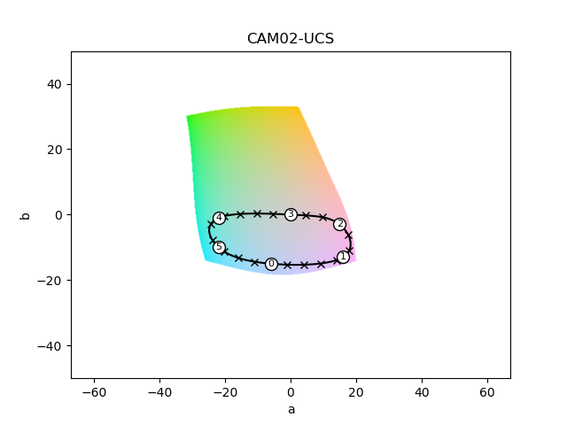

# Phase-Amplitude Perceptually Uniform Colormap Designer (papuc) ##
Papuc is a small library designed for creating perceptually uniform color mappings of vector fields where vector orientations/phase angles are mapped onto hue and vector magnitudes/amplitudes are mapped onto lightness. papuc is designed to integrate into the Matplotlib/NumPy ecosystem and relies on [colorspacious](https://colorspacious.readthedocs.io/en/latest/) for colorspace transformations. 

## Why? ##
Simply put, many people use the [HSV color wheel](https://en.wikipedia.org/wiki/HSL_and_HSV) for colormaping phase and amplitude. The HSV color wheel is handy for artists picking color palletes, but has serious failings as a color mapping for data visualization.   

## Citing Papuc ##
Our paper exploring the concepts, the improvements over HSV, and a case study are [here](Will_be_on_ArXiv_soon)

## Basic Usage ##
To get the color of a single point with an angle of 225 degrees and normalized magnitude of 0.8, it only takes 3 lines:
```python
>>> from numpy import pi
>>> from papuc.example_maps import colormaps
>>> my_map = colormaps['default']
>>> my_map(225 * pi/180,  0.8 )
array([0.43373149, 0.52916728, 0.7263222])
```

## A Feature Complete Example ##
If you just want to use a resonably good color map on your angle and magnitude data, our usage_example.py should be all you need. We start by creating some test data:
```python
from matplotlib import pyplot as plt
import numpy as np
##### Synthesizes some data to plot
npts = 16
xmax = 2
ymax = 1
X, Y = np.meshgrid(
    np.linspace(0, xmax , xmax * npts),
    np.linspace(0, ymax , ymax * npts))
U = np.sin(2*np.pi*Y)
V = np.cos(2*np.pi*X)
angle = np.arctan2(V,U)
magnitude = np.sqrt(V**2 + U**2)
magnitude_norm = magnitude/magnitude.max()
```
Now we make an sRGB1 image (r, g, and b scaled from 0.0 to 1.0) for our data:
```python
###### Now for visualization 
from papuc.example_maps import colormaps
my_map = colormaps['default']

## make an sRGB1 image from the data
image = my_map(angle, magnitude_norm)
```
This next part will plot the colormapped data with a quiver plot of the same vector field and show the colorwheel. 
```python
plt.imshow(image, origin = 'lower',  extent = (0, xmax, 0, ymax) )
plt.quiver(X, Y, U, V, units='width')

## save the image
plt.imsave('test_image.png', image, origin = 'lower')

## save the combined figure
plt.savefig('test_figure.png')

## this is for looking at your colormap's color wheel
fig, ax = plt.subplots()
from papuc.analysis import plot_colorwheel
plot_colorwheel(ax, my_map)
fig.tight_layout(pad= 0.1)
plt.savefig('test_colorwheel.png')

plt.show()
```
Which looks like this:


## Defining a Colormap with Knots ##
If you want to make your own isoluminant path, you'll start with the periodic spline knots:
```python
from papuc import isoluminant_uniform_spline_colormap
#### define a color map with knot points
L_max = 85 #   0   1    2    3    4    5
a_knots =  [  -6,  16,  15,  0,  -22, -22]
b_knots =  [ -15, -13,  -3,  0,   -1, -10]
my_map = isoluminant_uniform_spline_colormap( a_knots, b_knots, L_max)
```
Now you have a color map defined by those points! To see the path in the a, b plane:
```python
from matplotlib import pyplot as plt
from papuc.analysis import plot_knots_on_isoluminant_slice
fig, ax = plt.subplots()
plot_knots_on_isoluminant_slice(ax, my_map)
plt.show()
```
Which will look like this:



Check the example *simple_analysis_example.py* to see more options and a more thorough analysis.

